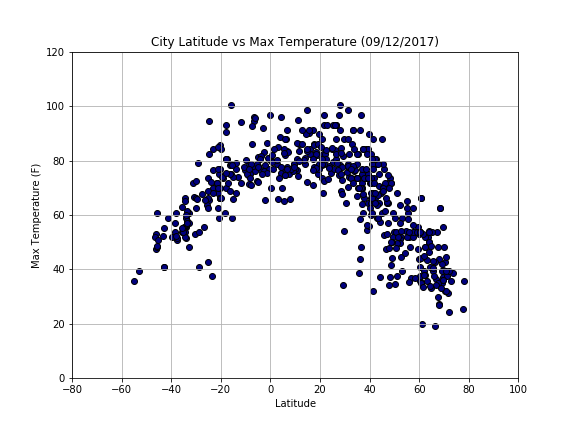

## WeatherPy




- A Python script was created to visualize the weather of 500+ cities across the world of varying distance from the equator. 

- Technologies: the OpenWeatherMap API, Pandas, Numpy, Matplotlib, Seaborn, etc


```python

```
